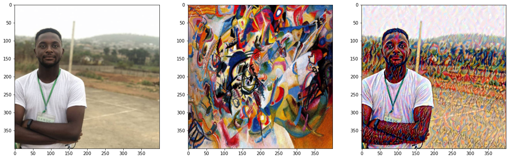
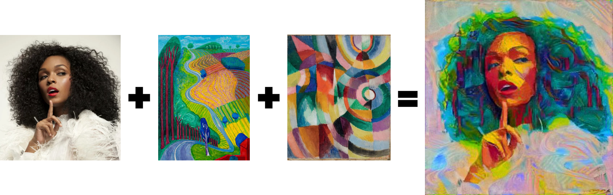

# Pytorch Implementation of Neural Style Transfer

## Installation
Create virtual environment
`pip install virtualenv
virtualenv styletransfer
source styletransfer/bin/activate
`
Install requirements
`pip install -r requirements.txt`

## Single Style Transfer
Involves a content image and style image.
The loss is the sum of the single content loss and the single style loss

## Multi Style Transfer
Involves a content image and multiple style images.
The style loss is gotten by adding the layer loss of each style image with respect to the target image for each layer.
The final loss is then the sum of the single content loss and the style loss.

## Links
- <a href="">Medium Post</a>
- <a href="https://www.udacity.com/course/deep-learning-pytorch--ud188">Udacity Deep Learning with Pytorch</a>

